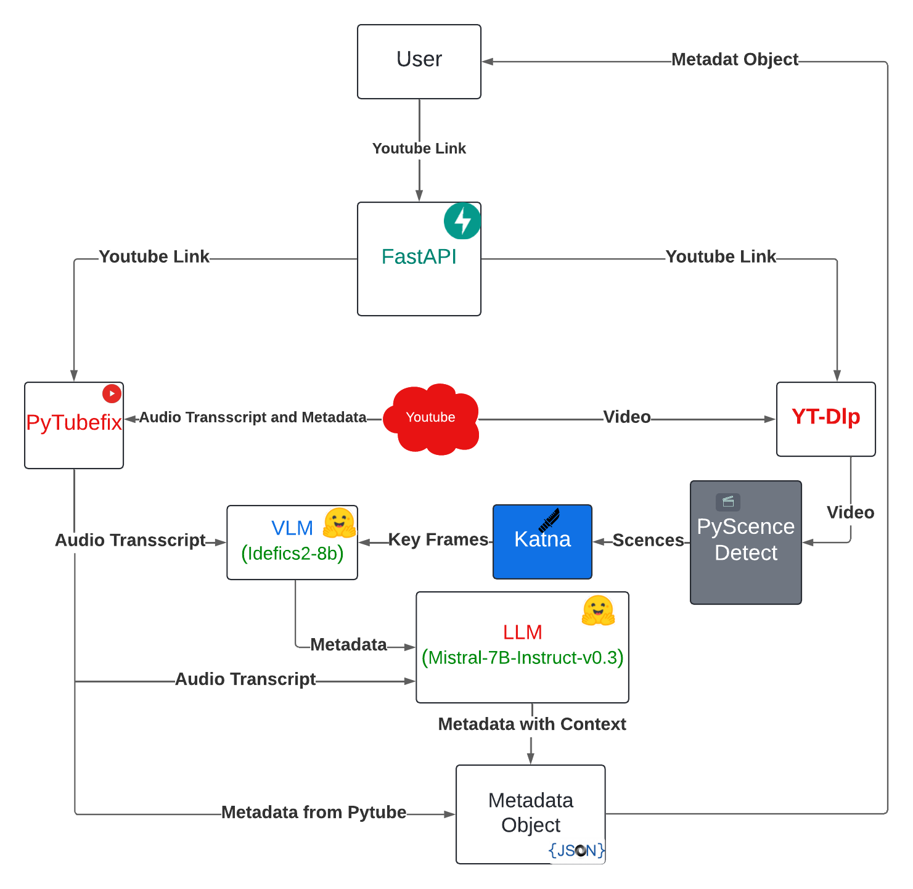

# awt-pj-ss24-finding_scenes-2


## Project Goal

This project enables the automatic extraction of semantic metadata from YouTube videos using their links. The extracted metadata is provided as a JSON object.

## Pipeline

The pipeline has following structure




First, the user provides a YouTube link, which is received by FastAPI. FastAPI forwards this link to both PyTube and YT-DLP to obtain the video and essential data from YouTube, including the audio transcript. Then, PyScence Detect is employed to segment the video into meaningful scenes. Katna is utilized to extract the most significant keyframes that represent each scene. Using these keyframes and the audio transcript, a Vision-Language Model (VLM) extracts important metadata from the scenes. Since the metadata generated by the VLM may lack context for the entire scene or video, a Large Language Model (LLM) is then used to contextualize this data. Finally, the contextualized data from the LLM is combined with the metadata already provided by PyTube to form a metadata object

## Metadata object json

```json
{
  "MetaDataObject": {
    "youtube_title": "str",
    "youtube_description": "str",
    "published_date": "str",
    "youtube_video_id": "str",
    "youtube_thumbnail_url": "str",
    "youtube_rating": "str",
    "youtube_views": "str",
    "youtube_age_restricted": "str",
    "youtube_keywords": ["str"],
    "youtube_author": "str",
    "youtube_channel_id": "str",
    "youtube_length": "int",
    "url": "str",
    "llm_description": "str",
    "learning_resource_type": "str",
    "intended_end_user_role": "str",
    "context": "str",
    "difficulty_level": "str",
    "discipline": "str",
    "educational_level": "str",
    "target_audience_age": "str",
    "typical_learning_time": "str",
    "scene_objects": ["SceneObject"]
  },
   "SceneObject":{
    "duration": "str",
    "scene_start": "str",
    "scene_end": "str",
    "title": "str",
    "caption": "str",
    "key-concepts": "str",
    "questions": "str",
    "text": "str",
    "resources": "str",
    "language": "str",
    "video_type": "str"
  }
}
```
## Setup


To install the project's python libraries, run the following command in your terminal:

```bash
pip install -r requirements.txt
```

Additionally, to install flash attention run:

```bash
pip install flash-attn --no-build-isolation
```

As with most python projects we recommend setting up a [virtual environment](https://docs.python.org/3/library/venv.html).

### Dependencies

To install the non python dependencies of the project run the following, depending on your systen:

#### Ubuntu

`sudo apt-get install ffmpeg imagemagick`

### Models

The models are downloaded from [huggingface](https://huggingface.co/) when running the program for the first time. To download Mistral-7B-Instruct-v0.3 you need to first create a HF account and ask for access on the [model page](https://huggingface.co/mistralai/Mistral-7B-Instruct-v0.3). After access has been granted, create an access token with write permissions and place it into the [constants file](./utils/constants.py). Now all models should be downloaded without any problems. 

## Running

We offer multiple ways to run the pipeline depending on what interaction level might be needed.

To make sure that there aren't any complications with running the scripts below, make sure that you added this repository to your python path by running.

```bash
export PYTHONPATH=$(pwd)
```

### Local as script
We offer a [script](./main.py) which you can run locally. To do this, run ```python main.py <YOUR_YOUTUBE_LINK>```.

### Local with FastApi
For the least interaction with the actual code you can start up the demo server by running ```python server.py``` and access the front-end under [localhost:8000](http://localhost:8000).

## Evaluation

For the evaluation of this project we created a small dataset containing manually created captions for 10 learning videos from YouTube. The datasets containing the manual and automated captions can be found under [eval](./eval).

To execute the evaluation cd into the eval directory and run:

```bash
python eval_predictions.py
```

The scripts for calculating the metrics were taken from [pycocoevalcap](https://github.com/salaniz/pycocoevalcap).
